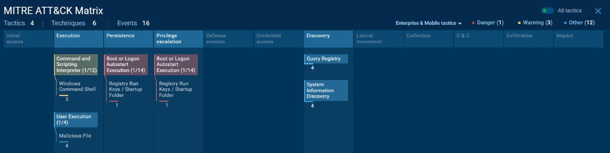
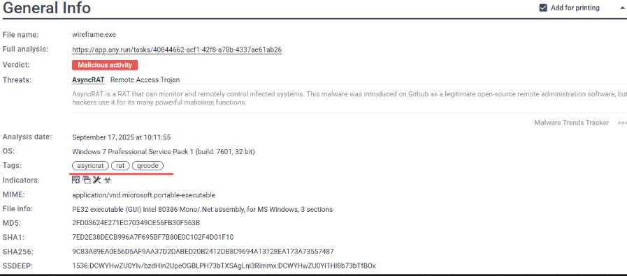

## 🔍 Estudo de Caso: Investigação de Incidente de Rede
Este projeto apresenta uma investigação forense digital completa, simulando o fluxo de trabalho de uma equipe de resposta a incidentes. O estudo percorre todas as etapas críticas, desde a detecção inicial de um alerta de rede até a geração de inteligência acionável para defesa cibernética. 

## 📝 Descrição do Projeto
A investigação foca na análise de um incidente de segurança iniciado por um alerta de um Sistema de Prevenção de Intrusão (IPS). Através de um estudo de caso prático, o projeto detalha o processo de:

- **Validação de Indicadores de Comprometimento (IOCs):** Verificação de integridade e consulta de hashes maliciosos em bases de conhecimento.
- **Análise Comportamental Dinâmica:** Execução do artefato wireframe.exe em ambiente seguro (sandbox) para identificar táticas de evasão e persistência.
- **Mapeamento Estratégico:** Classificação detalhada das Táticas, Técnicas e Procedimentos (TTPs) do adversário utilizando o framework MITRE ATT&CK.
- **Conformidade Legal:** Aplicação dos conceitos de Cadeia de Custódia conforme o Código de Processo Penal brasileiro (Pacote Anticrime), garantindo a integridade e validade jurídica das evidências.

## 🛠️ Tecnologias e Ferramentas

  
## 🔬 Metodologia
A metodologia aplicada neste estudo seguiu um fluxo sequencial dividido em quatro etapas principais, fundamentadas nos padrões de preservação de evidências digitais:

**1. Detecção e Triagem**  
O processo iniciou-se com a Detecção do Incidente, disparada por um alerta de um Sistema de Prevenção de Intrusão (IPS). A partir desse alerta, foi extraído o Indicador de Comprometimento (IOC) inicial: o hash MD5 2F3D3624E271EC70B49CE56BF3B8F563B.

**2. Coleta e Preservação**  
Seguindo os preceitos do Pacote Anticrime (Lei nº 13.964/2019) e os artigos 158-A a 158-F do CPP, o trabalho aplicou os conceitos de Cadeia de Custódia:

- Isolamento e Fixação: Procedimentos para evitar a alteração do vestígio e descrição detalhada da evidência.

- Verificação de Integridade: Uso de funções de hash (SHA-256) para garantir que a cópia de trabalho fosse idêntica ao original.

**3. Análise Comportamental (Exame e Análise)**  
Com a evidência preservada, realizou-se a Análise Dinâmica em ambiente de sandbox. Nesta fase, observou-se:

- Execução e Evasão: O uso de scripts .bat e a técnica de atraso via timeout.exe para contornar defesas automatizadas.

- Mascaramento: A tentativa do malware de se passar por um driver legítimo da NVIDIA (nvidiagpu.exe).

- Persistência: Modificação de chaves de registro para garantir a execução automática no logon do sistema.

**4. Inteligência e Classificação**  
A etapa final consistiu na Classificação da Ameaça, onde o comportamento observado foi mapeado no framework MITRE ATT&CK.

- Veredito: Identificação do artefato como um AsyncRAT, um cavalo de troia de acesso remoto focado em espionagem e controle persistente.

- Documentação: Elaboração de um Laudo Pericial objetivo, imparcial e reprodutível.

  

## 📈 Resultados e Recomendações
A investigação técnica permitiu dissecar a estratégia do atacante e identificar os seguintes pontos críticos:

- Identificação da Ameaça: O artefato foi classificado como um AsyncRAT, um cavalo de troia focado em obter controle remoto e persistência no sistema da vítima.

- Persistência Avançada: Identificou-se a modificação de chaves de registro para garantir a execução automática a cada inicialização do sistema (T1547.001), transformando uma infecção temporária em uma violação permanente.

- Táticas de Evasão: O malware utilizou o comando timeout.exe para atrasar sua execução e burlar análises automatizadas de sandboxes, além de se mascarar como um processo legítimo da NVIDIA (nvidiagpu.exe).

- Exfiltração e C2: Foi detectada atividade de "phone home" para o domínio malicioso tasteless-minister.auto.playit.gg.

  

**Plano de Ação Recomendado**  
Com base nos artefatos encontrados, propõe-se uma estratégia de resposta em três frentes:

- Contenção: Bloqueio imediato do hash MD5 e do domínio de Comando e Controle (C2) em ferramentas de EDR e Firewalls.

- Remediação: Isolamento total do sistema infectado, seguido de formatação e restauração via backup limpo para garantir a eliminação de mecanismos de persistência.

- Prevenção: Reforço do security hardening (monitoramento de processos legítimos) e programas de conscientização contra phishing e engenharia social.

## 📚 Referências

- [Systematic Digital Forensic Investigation Model](https://www.researchgate.net/publication/228410430_Systematic_Digital_Forensic_Investigation_Model)

- [American Public University - Recursos Forenses](https://www.apu.apus.edu/area-of-study/information-technology/resources/what-is-digital-forensics/)

- [STJ - Cadeia de Custódia](https://www.stj.jus.br/sites/portalp/Paginas/Comunicacao/Noticias/2023/23042023-A-cadeia-de-custodia-no-processo-penal-do-Pacote-Anticrime-a-jurisprudencia-do-STJ.aspx)
  
## ⚖️ Licença
Este projeto está licenciado sob a [Licença MIT](LICENSE).

